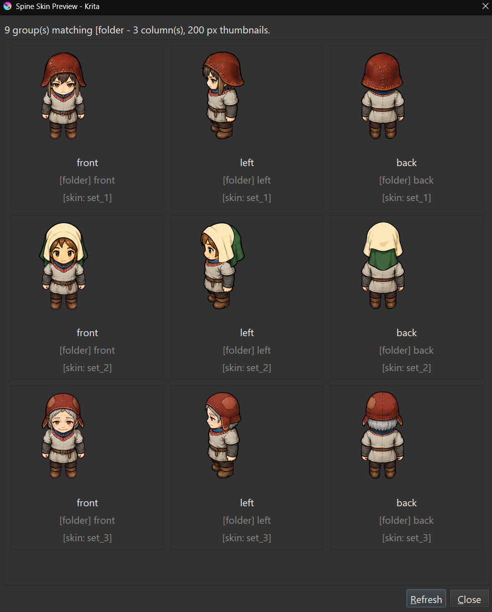
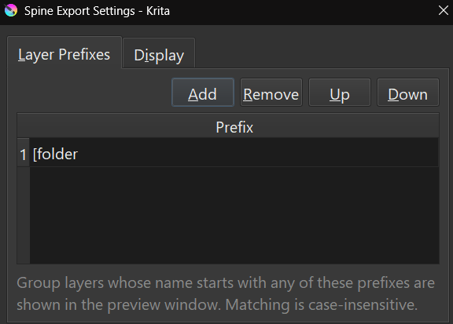
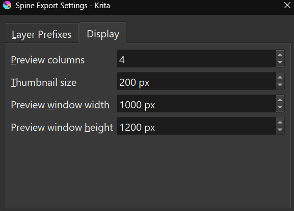

# Krita Spine Export

Krita Spine Export is a Krita Python plugin that exports document layers as PNG attachments plus Spine JSON, modeled after Esoteric Software's [PhotoshopToSpine.jsx](https://github.com/EsotericSoftware/spine-scripts/tree/master/photoshop) workflow.

## Usage

Save the Krita document, then run **Tools > Scripts > Export to Spine...**. Choose an **export folder**, scale, padding, and export options, then press **Export**.

The Krita file name determines the export location:

- A `kritaFileName` folder is created inside the export folder (without the file extension).
- The Spine JSON is written into the `kritaFileName` folder as `kritaFileName.json`.
- Images are written into an `images` folder inside the `kritaFileName` folder.

All exportable layers under the document root are exported, **both visible and hidden** by default. Enable **Ignore hidden layers** to skip hidden groups, hidden layers, and everything inside hidden groups. Root-level groups and layers whose names start with `_` are skipped, except that `_root_` can still be used as the origin marker.

The exporter writes:

- PNG files for exportable layers and `[merge]` groups, including enabled Krita layer styles. By default, each image and attachment name is prefixed with its immediate parent group name, for example `front_head.png`.
- Spine JSON with `bones`, `slots`, `skins`, and an empty animation.
- Optional `template.png` from the current document projection.

## Skin Preview

Run **Tools > Scripts > show preview thumbnail** to open a non-modal window that
lists every group layer whose name starts with one of the configured prefixes
(`[skin` by default). Groups are searched recursively, skipping root-level nodes
whose names start with `_`, and prefix matching is case-insensitive. Each entry
shows a thumbnail of the group, its name with tags stripped, and its raw name.
Press **Refresh** after editing layers to regenerate the thumbnails.

Run **Tools > Scripts > show spine export settings** to configure the preview.
The **Layer Prefixes** tab holds the list of name prefixes to match, with
**Add**, **Remove**, **Up**, and **Down** buttons; 

The **Display** tab holds the
grid column count, thumbnail size, and the preview window's initial width and
height. 

Settings are stored in a `spine_export` folder
next to the `pykrita` folder in the Krita resources directory
(`.../krita/spine_export/preview.json`), resolved relative to the installed
plugin path. Saving the settings refreshes an open preview window.

## Root Marker

A layer named `_root_` anywhere in the document can be used as an origin marker. Its visible pixel bounds are used to find the marker center, and that point becomes Spine `0,0`; all exported attachment and bone positions are offset relative to it.

## Supported Tags

Tags can be placed in layer or group names using the same square-bracket style as PhotoshopToSpine.

- `[bone]` or `[bone:name]`
- `[slot]` or `[slot:name]`
- `[skin]` or `[skin:name]`
- `[folder]` or `[folder:name]`
- `[scale:number]`
- `[trim]` or `[trim:false]`
- `[mesh]` or `[mesh:name]`
- `[ignore]`
- `[merge]` on groups
- `[name:pattern]` on groups, where `pattern` contains `*`
- `[path:name]` on layers or merged groups
